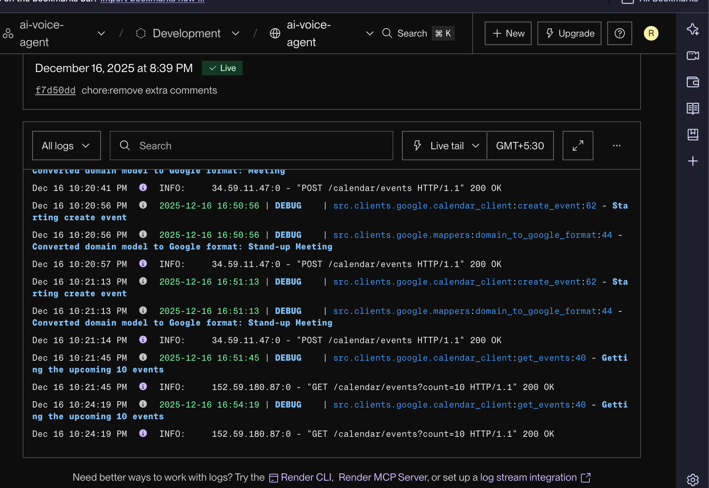
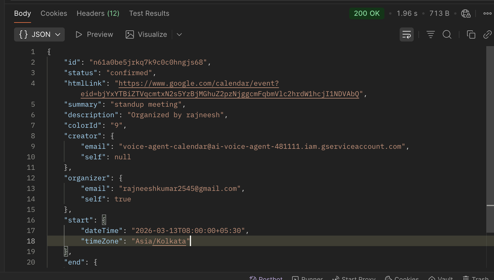
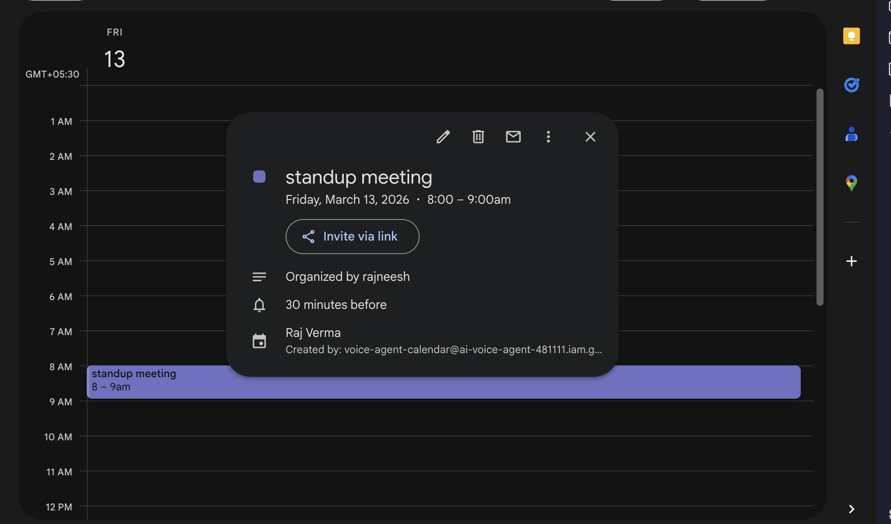

# AI Voice Scheduling Agent 🎙️📅
- Loom video demo
👉 [https://www.loom.com/share/2814377840e34d54a526bae36cdec546](https://www.loom.com/share/2814377840e34d54a526bae36cdec546)

It is a real-time AI voice assistant that schedules meetings by conversing with users and creating **actual Google Calendar events**.
The system uses **ElevenLabs** for the voice agent and a **FastAPI backend** for calendar operations, supporting both **OAuth 2.0** and **Service Account** authentication.

---

## 📌 Assignment Overview

**Voice Scheduling Agent (Deployed)**

The agent:

- Initiates a conversation with the user
- Asks for:

  - Name
  - Preferred date & time
  - Optional meeting title

- Confirms the details verbally
- Sends the finalized data to the backend via a **webhook**
- Creates a real calendar event
- Is deployed and accessible via a hosted URL

---

## 🔗 Deployed URLs

### 🎙️ Voice Agent (ElevenLabs)

Talk to the agent here:

👉 [https://elevenlabs.io/app/talk-to?agent_id=agent_9801kcbg726cek09wqd9ja5s3t1t&branch_id=agtbrch_5201kcbg731ze1etajtaab7z44mr](https://elevenlabs.io/app/talk-to?agent_id=agent_9801kcbg726cek09wqd9ja5s3t1t&branch_id=agtbrch_5201kcbg731ze1etajtaab7z44mr)

---

### 📅 Calendar Backend API (FastAPI)

Backend deployed on **Render**:

👉 [https://ai-voice-agent-esai.onrender.com](https://ai-voice-agent-esai.onrender.com)

---

## 🧠 System Flow (Webhook-Based)

1. The voice agent initiates the conversation
2. Collects user details (name, date, time, optional title)
3. Confirms the meeting details verbally
4. Sends structured data to the backend using a **webhook**
5. FastAPI backend receives the request
6. Backend authenticates with Google Calendar
7. A real calendar event is created
8. Event appears instantly in the linked Google Calendar

---

## 🛠️ Tech Stack

### Voice Layer

- ElevenLabs AI Agent
- Real-time speech-to-text & text-to-speech

### Backend

- Python
- FastAPI
- Google Calendar API

### Deployment

- Backend: Render
- Voice Agent: ElevenLabs

---

## 🔐 Calendar Integration (OAuth + Service Account)

This project supports **both Google OAuth 2.0 and Google Service Account authentication**.
The authentication strategy is controlled via an environment variable.

```env
USE_SERVICE_ACCOUNT=true
```

- `true` → Service Account (production)
- `false` → OAuth 2.0 (development)

---

### 1️⃣ Service Account Authentication (Production)

- Used in deployed environments
- No browser-based login required
- Service account email is granted access to the target calendar
- Authentication uses `service_account.json`

**Flow:**

1. Backend loads service account credentials
2. Server authenticates with Google Calendar API
3. Events are created server-to-server

---

### 2️⃣ OAuth 2.0 Authentication (Development)

- Used for local development
- Requires browser-based consent
- OAuth tokens are generated and stored locally

---

## 📅 Calendar Backend API (FastAPI)

The backend exposes APIs to fetch and create calendar events.
These endpoints are called by the voice agent via webhook.

---

### 🔍 Fetch Calendar Events

```http
GET /calendar/events
```

#### Query Parameters

- `count` _(optional)_ – Maximum number of events to return

Example:

```http
GET /calendar/events?count=2
```

#### Response

Returns a list of calendar events:

```json
{
  "events": [
    {
      "id": "0drb2p8ubfce2nud0krrodgmek",
      "status": "confirmed",
      "htmlLink": "https://www.google.com/calendar/event?eid=MGRyYjJwOHViZmNlMm51ZDBrcnJvZGdtZWsgcmFqbmVlc2hrdW1hcjI1NDVAbQ",
      "summary": "click 6 rajnesh",
      "description": "Organized by rajneesh",
      "colorId": "9",
      "creator": {
        "email": "voice-agent-calendar@ai-voice-agent-481111.iam.gserviceaccount.com",
        "self": null
      },
      "organizer": {
        "email": "rajneeshkumar2545@gmail.com",
        "self": true
      },
      "start": {
        "dateTime": "2025-12-18T05:00:00+05:30",
        "timeZone": "Asia/Kolkata"
      },
      "end": {
        "dateTime": "2025-12-18T06:00:00+05:30",
        "timeZone": "Asia/Kolkata"
      }
    },
    {
      "id": "1shclipc5pej8d06bm655io1ug",
      "status": "confirmed",
      "htmlLink": "https://www.google.com/calendar/event?eid=MXNoY2xpcGM1cGVqOGQwNmJtNjU1aW8xdWcgcmFqbmVlc2hrdW1hcjI1NDVAbQ",
      "summary": "click 2 rajnesh",
      "description": "demo description",
      "colorId": "9",
      "creator": {
        "email": "voice-agent-calendar@ai-voice-agent-481111.iam.gserviceaccount.com",
        "self": null
      },
      "organizer": {
        "email": "rajneeshkumar2545@gmail.com",
        "self": true
      },
      "start": {
        "dateTime": "2025-12-18T05:00:00+05:30",
        "timeZone": "Asia/Kolkata"
      },
      "end": {
        "dateTime": "2025-12-18T05:36:00+05:30",
        "timeZone": "Asia/Kolkata"
      }
    }
  ]
}
```

---

### ➕ Create Calendar Event

```http
POST /calendar/events
```

#### Request Body

```json
{
  "title": "click 8 rajnesh",
  "author": "rajneesh",
  "date": "2025-12-18",
  "time": "05:00"
}
```

#### Response

```json
{
  "id": "ev652gs8r83o25mp1afsftl8gs",
  "status": "confirmed",
  "htmlLink": "https://www.google.com/calendar/event?eid=ZXY2NTJnczhyODNvMjVtcDFhZnNmdGw4Z3MgcmFqbmVlc2hrdW1hcjI1NDVAbQ",
  "summary": "click 8 rajnesh",
  "description": "Organized by rajneesh",
  "colorId": "9",
  "creator": {
    "email": "voice-agent-calendar@ai-voice-agent-481111.iam.gserviceaccount.com",
    "self": null
  },
  "organizer": {
    "email": "rajneeshkumar2545@gmail.com",
    "self": true
  },
  "start": {
    "dateTime": "2025-12-18T05:00:00+05:30",
    "timeZone": "Asia/Kolkata"
  },
  "end": {
    "dateTime": "2025-12-18T06:00:00+05:30",
    "timeZone": "Asia/Kolkata"
  }
}
```
## 🧪 How to Test the Voice Agent

1. Open the **Voice Agent URL** in your browser.
2. Start a conversation with the agent.
3. Provide the meeting details (title, date, time, participants, etc.).
4. Verbally **confirm** the meeting when the agent asks for confirmation.
5. Verify that the event was created successfully by calling the backend API:

```http
GET /calendar/events?count=5
```

This endpoint should return the most recent calendar events, including the one you just created.

---

## 🧑‍💻 Run Backend Locally (Optional)

Follow these steps to run the backend service on your local machine:

```bash
git clone <repo-url>
cd ai-voice-agent
pip install -r requirements.txt
uvicorn src.main:app --reload
```

Once the server is running, the API will be available at:

```
http://localhost:8000
```

You can now test the voice agent and calendar APIs locally.


## 📸 Proof of Working
- Google Calendar screenshots




---

## 👤 Author

**Rajneesh Verma**
AI Voice Scheduling Agent – Assignment Submission
